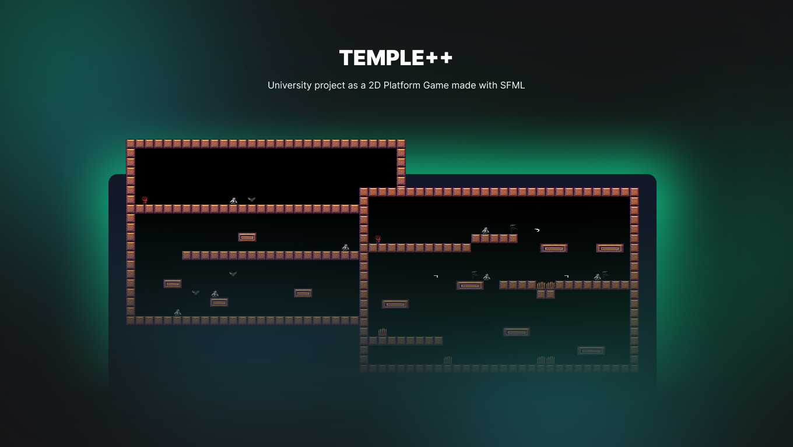

	
	<h3 align="center">Temple++</h3>

University project as a platform game 2D made with SFML graphics library.

---

 <a href="#about">About</a> •
 <a href="#started">Getting started</a> •
 <a href="#built_using">Technologies</a> •
 <a href="#authors">Authors</a> •
 <a href="#acknowledgement">Acknowledgements</a>

---

## 🧐 About 
The discipline of Programming Techniques requires the development of software in the form of a platform game, so that software engineering techniques are applied, specifically object-oriented programming in the C++ programming language.

For this, in this work, the Temple++ game was chosen, in which the player faces enemies in a given scenario. The game has two phases that are differentiated by difficulties for the player. For the development of the game, the textually proposed requirements were considered and modeling was elaborated (analysis and design) via Class Diagram in Unified Modeling Language (UML) using a generic and previously proposed diagram as base. Subsequently, in C++ programming language, development was carried out that included the most common Object Orientation concepts such as Class, Object and Relationship, as well as some advanced concepts such as Abstract Class, Polymorphism, Templates, Operator Overloading and Standard Library Templates (Standard Template Library — STL).

After the implementation, the tests and use of the game, made by the developers themselves, demonstrated its functionality according to the requirements and the elaborate modeling. Finally, it should be noted that the development in question made it possible to fulfill the learning objective initially envisaged.

## ⚙ Built with 

## ✍️ Authors 
- [@Hiyudev](https://github.com/Hiyudev)
- [@thiagomh](https://github.com/thiagomh)

## © License
- MIT License